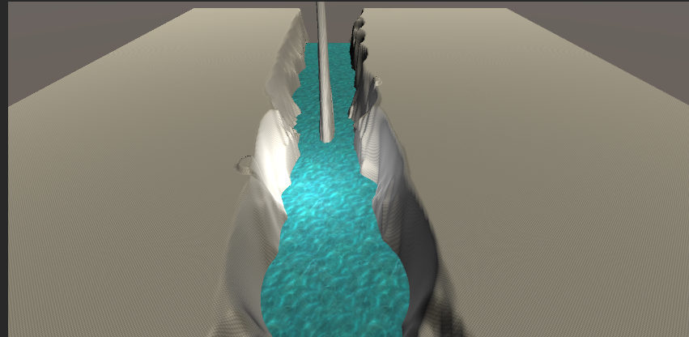

# UVスクロールと半透明

* 川をきれいに流そう
* 光を差し込ませよう

# 拡張した点

-川が流れるようにしました

-光を差し込ませました
-
-

# 進め方

- 本リポジトリをフォークしてください
- フォークしたリポジトリをcloneします
- Unityのプロジェクトを更新して実装してください。
- このテキストファイルに変更点を記載してください
- result.pngを自分の結果を保存して差し替えてください
- プルリクエストを出して提出してください
